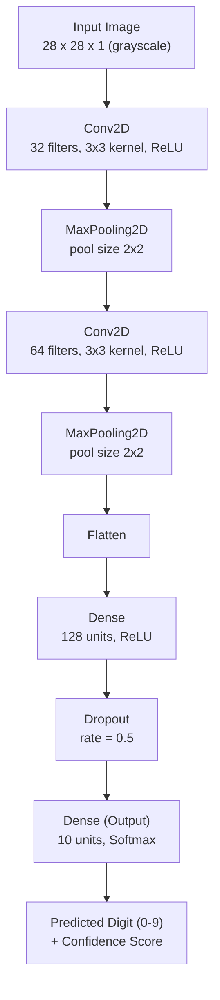
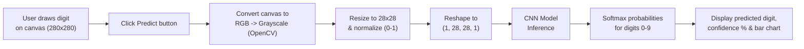

# ✍️ Handwritten Digit Recognizer

A Streamlit web app that lets you **draw a digit (0–9)** on an interactive canvas and get a real‑time prediction from a **Convolutional Neural Network (CNN)** trained on the MNIST dataset — complete with a confidence score and per‑class probability chart.


---

## 📖 Overview

This project trains and compares three progressively more powerful models on the **MNIST handwritten digits dataset** — a single‑layer **Perceptron**, a fully‑connected **ANN**, and a **CNN** — then ships the best‑performing model (the CNN) inside a polished, dark‑themed Streamlit app where users can hand‑draw digits and get instant predictions.

| Model | Architecture | Test Accuracy |
|---|---|---|
| Perceptron | `Flatten → Dense(10, softmax)` | **92.71%** |
| ANN | `Flatten → Dense(128) → Dense(64) → Dense(10)` | **97.25%** |
| **CNN (used in app)** | `Conv2D → Pool → Conv2D → Pool → Dense → Dropout → Dense(10)` | **99.03%** |

---

## 🧠 CNN Model Architecture

The deployed model (`cnn_model1.h5`) is a compact CNN trained on 28×28 grayscale MNIST images.



### Layer-by-layer summary

| # | Layer | Output Shape | Details |
|---|---|---|---|
| 1 | Input | 28×28×1 | Normalized grayscale pixel values (0–1) |
| 2 | Conv2D | 26×26×32 | 32 filters, 3×3 kernel, ReLU activation |
| 3 | MaxPooling2D | 13×13×32 | 2×2 pool size, downsamples spatial dims |
| 4 | Conv2D | 11×11×64 | 64 filters, 3×3 kernel, ReLU activation |
| 5 | MaxPooling2D | 5×5×64 | 2×2 pool size |
| 6 | Flatten | 1600 | Flattens feature maps into a 1D vector |
| 7 | Dense | 128 | Fully connected, ReLU activation |
| 8 | Dropout | 128 | 50% dropout for regularization |
| 9 | Dense (Output) | 10 | Softmax activation, one unit per digit class |

**Training configuration**
- Optimizer: `Adam`
- Loss: `categorical_crossentropy`
- Metric: `accuracy`
- Epochs: `3` | Batch size: `32`
- Dataset: MNIST (60,000 train / 10,000 test images, 28×28 grayscale)
- Final test accuracy: **99.03%**

---

## 🖥️ Application Flow



---

## 📂 Project Structure

```
.
├── app.py               # Streamlit web application (UI + inference)
├── CNN.ipynb             # Model training notebook (Perceptron, ANN, CNN)
├── cnn_model1.h5          # Trained CNN model weights
├── requirements.txt       # Python dependencies
└── README.md
```

---

## 🚀 Getting Started

### 1. Clone the repository
```bash
git clone https://github.com/<your-username>/digit-recognizer.git
cd digit-recognizer
```

### 2. Install dependencies
```bash
pip install -r requirements.txt
```

### 3. Run the app
```bash
streamlit run app.py
```

The app will open in your browser at `http://localhost:8501`.

---

## 🎨 How to Use

1. **Draw** — Sketch a digit (0–9) on the canvas using your mouse.
2. **Predict** — Click the **Predict** button.
3. **Results** — View the predicted digit, confidence percentage, the preprocessed 28×28 image, and a probability distribution bar chart across all 10 classes.

---

## 🛠️ Tech Stack

- **Frontend / App**: [Streamlit](https://streamlit.io/), [streamlit-drawable-canvas](https://github.com/andfanilo/streamlit-drawable-canvas)
- **Deep Learning**: TensorFlow / Keras
- **Image Processing**: OpenCV, Pillow
- **Data & Visualization**: NumPy, Pandas, Matplotlib, Seaborn

---

## 📊 Model Comparison

Three models were trained and benchmarked on the same MNIST train/test split to demonstrate how architecture choice affects accuracy:

- **Perceptron** — a single dense layer baseline, no hidden layers.
- **ANN** — a fully connected network with two hidden layers (128 → 64 units).
- **CNN** — convolutional layers that learn spatial features, achieving the highest accuracy and used in the deployed app.

See `CNN.ipynb` for the full training code, accuracy/loss curves, and side-by-side prediction comparisons.

---

## 📄 License

This project is open source and available under the [MIT License](LICENSE).

---

## 🙌 Acknowledgements

- [MNIST Dataset](http://yann.lecun.com/exdb/mnist/) — Yann LeCun et al.
- Built with ❤️ using TensorFlow and Streamlit.
